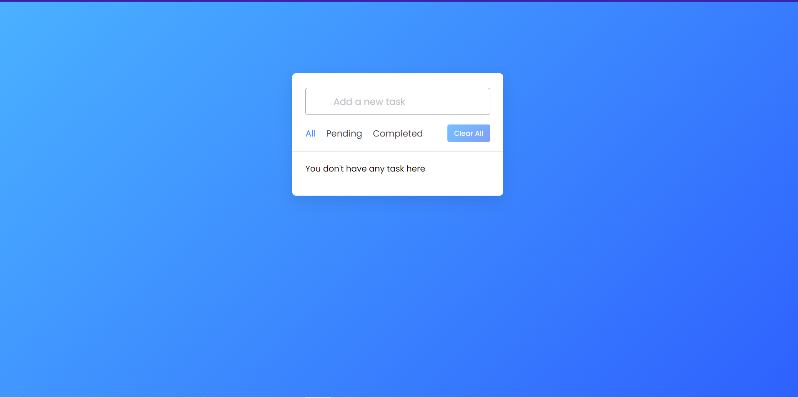
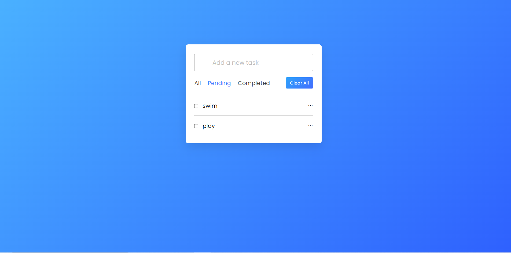
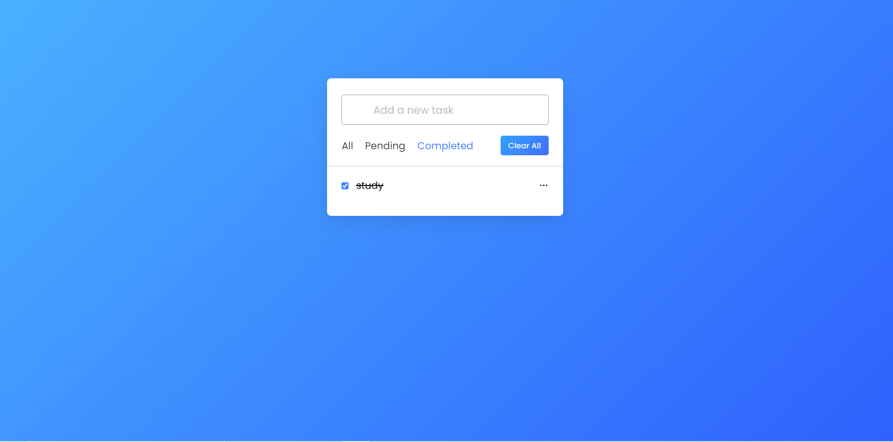
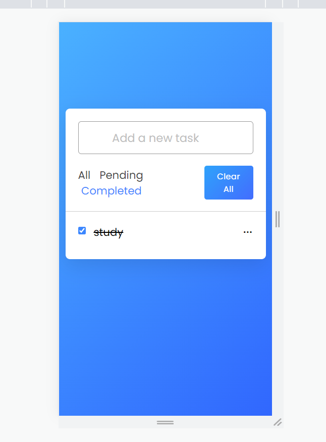

<h1>TODO</h1>

<h3>user friendly todo app with folloeing features mentioned : </h3>
 user can easily add their todos  
user can see all the todos 
user can mark as done once it is done 
user can also delete the task once it is don 

 

<h1>see the glimpses</h1>

visit : 

